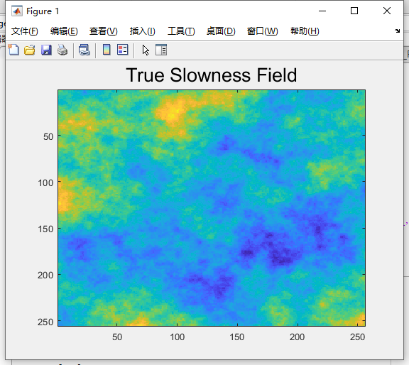
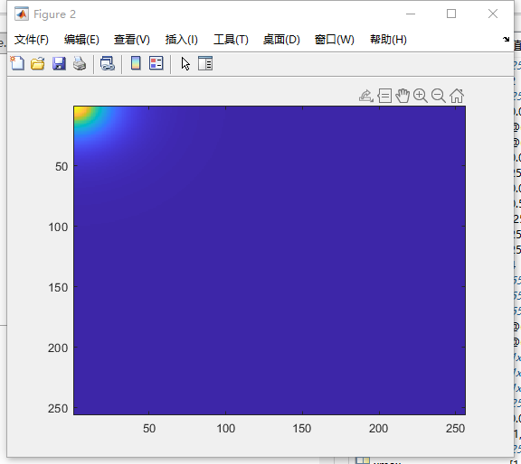
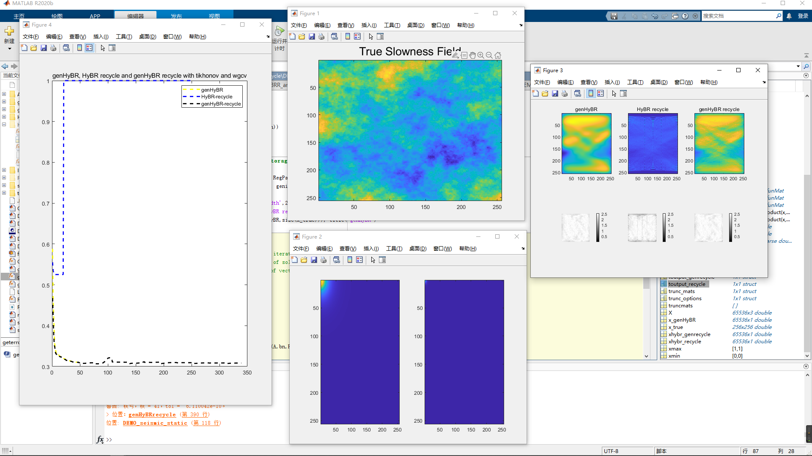
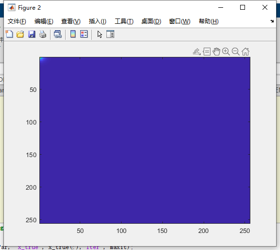
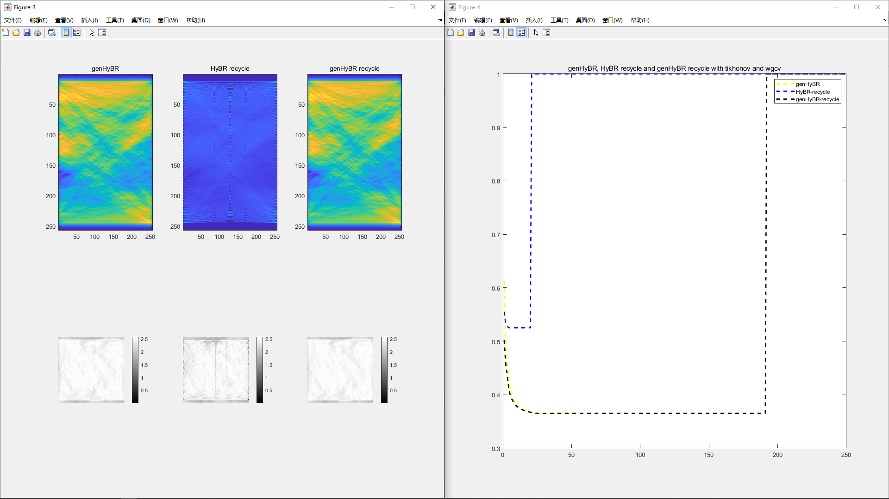
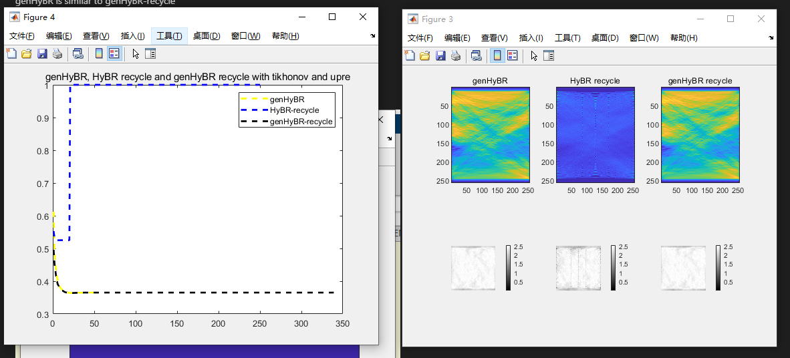
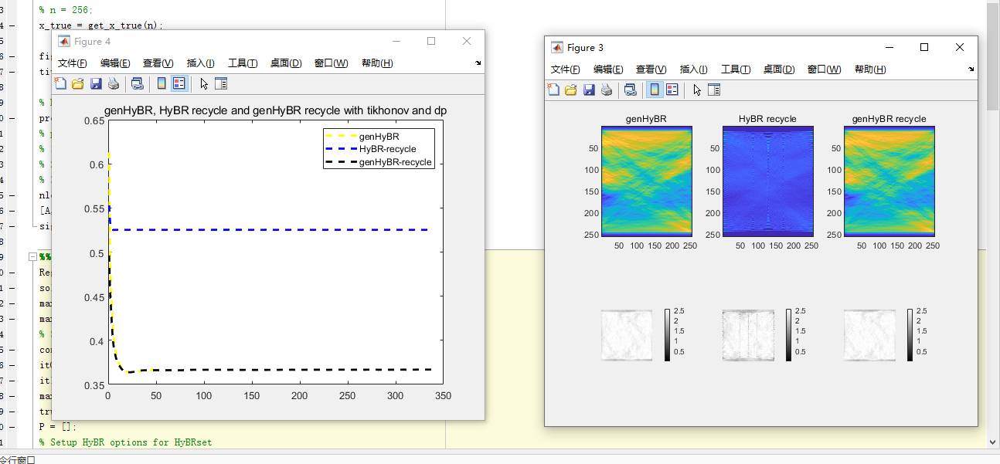
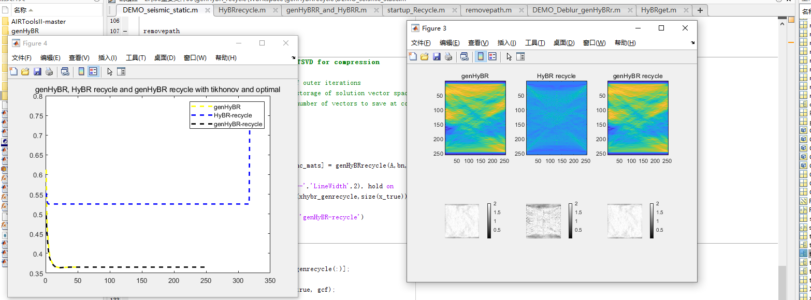

# Report for seismic
# True01

## Parameters 01
True field  
n = 256 nLevel = 0.01  
RegPar = 'wgcv' 
solver = 'tikhonov'  
maxit = 50;
maxit2 = 250;  
% Set trunction options and matrices  
compression = 'SVD'; % compression method  
itOuter = 11; % number of outer iterations  
itInner = 50; % maximum storage of solution vector space  
maxvec = 20;  % maximum number of vectors to save at compression  
truncmats = [];   
alpha = 2; l = 0.05;  
Q1
### Result  

### Problem 
HyBR-recycle stopped at iteration 20 and E-nrm jumpped to 1  
genHyBR is similar to genHyBR-recycle  
亏秩

## Parameters 02
nu2 = 0.5; ell2 = 0.01;   
Q2
### Result  

## Parameters 03 (use qr2)
RegPar = 'upre'  

## Parameters 04 (use qr2)
RegPar = 'dp'  

## Parameters 05 (use qr2)
RegPar = 'optimal'  
